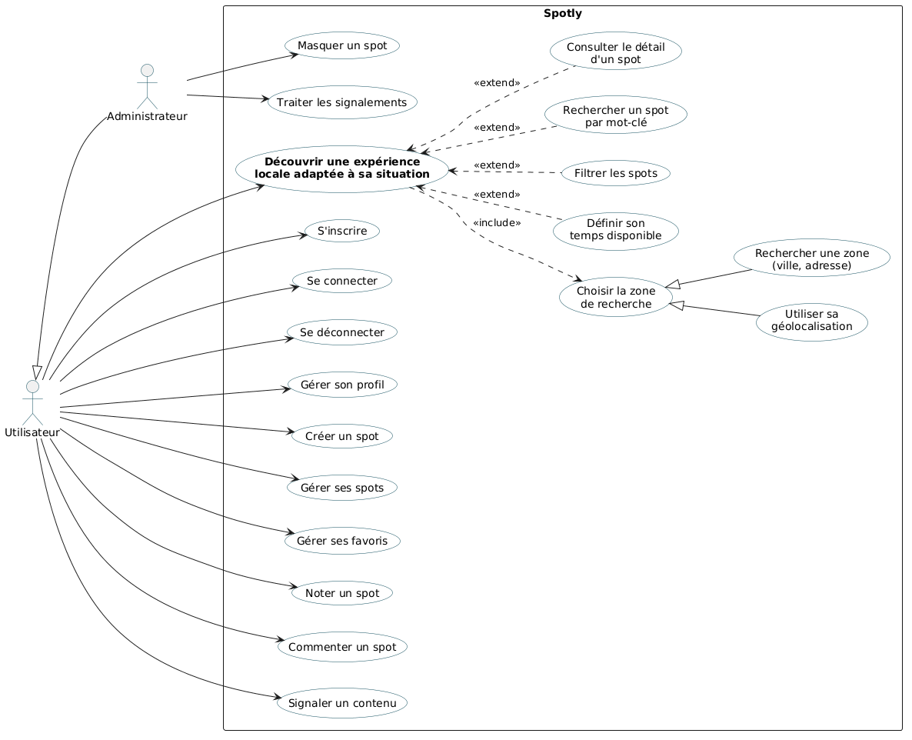

# 3.3 Cas d'utilisation

Les cas d'utilisation formalisent les interactions entre les acteurs et l'application Spotly. Ils permettent d'identifier les fonctionnalités accessibles à chaque acteur et les actions nécessaires à la réalisation des principaux parcours.

Ils sont définis à partir de l'expression du besoin et alignés sur le [backlog](backlog.md) et les [décisions de conception](decisions-de-conception.md). Chaque cas d'utilisation est relié aux User Stories qui le réalisent.

## 3.3.1 Acteurs

Deux acteurs sont retenus : l'**utilisateur** et l'**administrateur** (voir [3.2 Les acteurs et leurs rôles](3.2_Acteurs_&_roles.md)).

L'administrateur est un utilisateur disposant de droits supplémentaires. Dans le diagramme, cette relation est représentée par une **généralisation** : l'administrateur hérite de tous les cas d'utilisation de l'utilisateur et dispose en plus des cas d'utilisation de modération.

L'utilisation de Spotly nécessite un compte. Seules l'inscription et la connexion sont accessibles sans être connecté.

## 3.3.2 Cas d'utilisation de l'utilisateur

| Cas d'utilisation | Description | User Stories | Priorité |
| --- | --- | --- | --- |
| **S'inscrire** | Créer un compte afin d'accéder à l'application. | US-01 | P1 |
| **Se connecter** | S'authentifier afin d'accéder à l'application et à ses données personnelles. | US-02 | P1 |
| **Se déconnecter** | Fermer sa session. | US-02 | P1 |
| **Découvrir une expérience locale adaptée à sa situation** | Cas d'utilisation principal : trouver un spot correspondant à sa position et à son temps disponible. | US-03 | P1 |
| **Choisir la zone de recherche** | Déterminer la zone dans laquelle chercher des spots, par géolocalisation ou par recherche manuelle. | US-03, US-04 | P1 |
| **Utiliser sa géolocalisation** | Autoriser Spotly à utiliser sa position pour afficher les spots à proximité. | US-03 | P1 |
| **Rechercher une zone** | Saisir une ville ou une adresse lorsque la géolocalisation est refusée ou indisponible, ou pour explorer une autre zone. | US-04 | P1 |
| **Définir son temps disponible** | Indiquer le temps dont on dispose afin de ne voir que les spots compatibles. | US-16 | P1 |
| **Filtrer les spots** | Affiner les résultats par catégorie, tags et distance. | US-05 | P1 |
| **Rechercher un spot par mot-clé** | Rechercher une expérience à partir d'un mot-clé. | US-04 | P1 |
| **Consulter le détail d'un spot** | Consulter la fiche d'un spot : description, photos, catégorie, tags, durée et distance. | US-06 | P1 |
| **Créer un spot** | Publier une nouvelle expérience locale. | US-07 | P1 |
| **Gérer ses favoris** | Ajouter un spot à ses favoris, l'en retirer et consulter la liste de ses favoris. | US-08, US-09 | P1 |
| **Gérer ses spots** | Modifier ou supprimer un spot dont on est l'auteur. | US-18 | P1 |
| **Noter un spot** | Attribuer à un spot une note de 1 à 5, modifiable. | US-11 | P2 |
| **Commenter un spot** | Publier un retour d'expérience sur un spot. | US-10 | P2 |
| **Signaler un contenu** | Signaler un spot ou un commentaire qui ne respecte pas les règles de la plateforme. | US-12 | P2 |
| **Gérer son profil** | Consulter et modifier les informations de son compte. | US-13, US-14 | P2, P3 |

## 3.3.3 Cas d'utilisation de l'administrateur

En plus des cas d'utilisation de l'utilisateur, l'administrateur dispose des cas suivants.

| Cas d'utilisation | Description | User Stories | Priorité |
| --- | --- | --- | --- |
| **Masquer un spot** | Retirer un spot de la vue des utilisateurs, ou le republier. | US-17 | P1 |
| **Traiter les signalements** | Consulter les signalements, examiner le contenu concerné et décider de l'action à mener. | US-15 | P3 |

L'administrateur se connecte avec le même formulaire que les autres utilisateurs. Ses droits sont déterminés par son rôle, vérifié par l'API à chaque action de modération.

## 3.3.4 Fonctionnalité principale : découvrir une expérience locale

Le cas d'utilisation principal de Spotly est :

> **Découvrir une expérience locale adaptée à sa situation**

Il répond directement à la problématique définie dans l'expression du besoin :

> **« Comment permettre à un voyageur de trouver rapidement une activité ou une expérience locale pertinente, à proximité de sa position et adaptée au temps dont il dispose ? »**

Il s'appuie sur plusieurs cas d'utilisation, reliés de trois manières différentes dans le diagramme.

### Inclusion (`<<include>>`) : ce qui est toujours réalisé

Découvrir des spots nécessite **toujours** de connaître la zone de recherche. Le cas « Choisir la zone de recherche » est donc **inclus** dans le cas principal.

### Généralisation : deux manières de choisir la zone

La zone peut être déterminée de deux façons : en **utilisant sa géolocalisation** ou en **recherchant une zone** manuellement (ville, adresse). Ces deux cas sont des **spécialisations** de « Choisir la zone de recherche ».

Cette modélisation montre que la géolocalisation n'est **pas obligatoire** : si l'utilisateur la refuse ou si elle est indisponible, la recherche manuelle prend le relais.

### Extension (`<<extend>>`) : ce qui est facultatif

Les cas suivants **étendent** le cas principal : l'utilisateur peut les réaliser, mais ce n'est pas obligatoire.

- **Définir son temps disponible** : critère central de Spotly, mais l'utilisateur peut le retirer pour afficher tous les spots (US-16).
- **Filtrer les spots** : par catégorie, tags et distance.
- **Rechercher un spot par mot-clé**.
- **Consulter le détail d'un spot**.

Ce choix de modélisation est volontaire : un `<<include>>` signifierait que l'utilisateur doit **obligatoirement** filtrer ou rechercher par mot-clé à chaque découverte, ce qui ne correspond pas au fonctionnement prévu.

## 3.3.5 Déroulement du cas d'utilisation principal

### Préconditions

- L'utilisateur est connecté.
- Des spots publiés existent dans la base de données.

### Scénario nominal

1. L'utilisateur ouvre Spotly.
2. L'application lui demande l'autorisation d'accéder à sa localisation.
3. L'utilisateur autorise l'accès à sa position.
4. Spotly récupère sa position et affiche les spots publiés de la zone visible.
5. L'utilisateur indique le temps dont il dispose.
6. Spotly n'affiche plus que les spots dont la durée estimée est compatible avec ce temps.
7. L'utilisateur peut appliquer des filtres supplémentaires.
8. L'utilisateur sélectionne un spot.
9. Spotly affiche la fiche détaillée de l'expérience.
10. L'utilisateur choisit l'expérience qui correspond le mieux à sa situation.

### Scénarios alternatifs

- **Localisation refusée ou indisponible** (étapes 2 à 4) : l'utilisateur recherche une ville ou une adresse. La carte se recentre sur cette zone et le scénario reprend à l'étape 5.
- **Aucun spot ne correspond aux critères** (étape 6 ou 7) : l'application l'indique et propose d'augmenter le temps disponible, d'élargir la zone ou de retirer des filtres.
- **Spot devenu indisponible** (étape 9) : si le spot a été masqué ou supprimé entre-temps, l'application indique qu'il n'est plus disponible et l'utilisateur revient à la carte.

## 3.3.6 Organisation des cas d'utilisation

Les cas d'utilisation sont regroupés en quatre domaines fonctionnels. Dans le diagramme, ils sont déclarés dans cet ordre.

| Domaine | Cas d'utilisation |
| --- | --- |
| **Découverte** | Découvrir une expérience locale adaptée à sa situation, Choisir la zone de recherche, Utiliser sa géolocalisation, Rechercher une zone, Définir son temps disponible, Filtrer les spots, Rechercher un spot par mot-clé, Consulter le détail d'un spot |
| **Compte** | S'inscrire, Se connecter, Se déconnecter, Gérer son profil |
| **Contribution et interactions** | Créer un spot, Gérer ses spots, Gérer ses favoris, Noter un spot, Commenter un spot, Signaler un contenu |
| **Modération** | Masquer un spot, Traiter les signalements |

## 3.3.7 Hors périmètre actuel

Les cas d'utilisation suivants font partie de la vision du produit, mais ne sont pas retenus dans le périmètre actuel. Ils ne figurent donc pas dans le diagramme.

| Cas d'utilisation | Raison |
| --- | --- |
| Gérer les utilisateurs (suspendre un compte) | La suspension de compte est une évolution. |
| Gérer les catégories | La liste des catégories est initialisée en base pour le MVP. Sa gestion depuis l'interface est une évolution. |
| Liker un spot | Les likes sont remplacés par les notes (décision D2). |
| Renseigner ses préférences | Les préférences utilisateur sont hors MVP (décision D6). |

## 3.3.8 Diagramme de cas d'utilisation

Le diagramme ci-dessous représente les acteurs, les cas d'utilisation et leurs relations. Il répond à la question **« Qui peut faire quoi dans l'application ? »**, en restant au niveau des fonctionnalités métier, sans représenter chaque écran.

Il a été réalisé avec **PlantUML**. Le code source est versionné dans [uml/cas-utilisation-spotly.puml](uml/cas-utilisation-spotly.puml).

