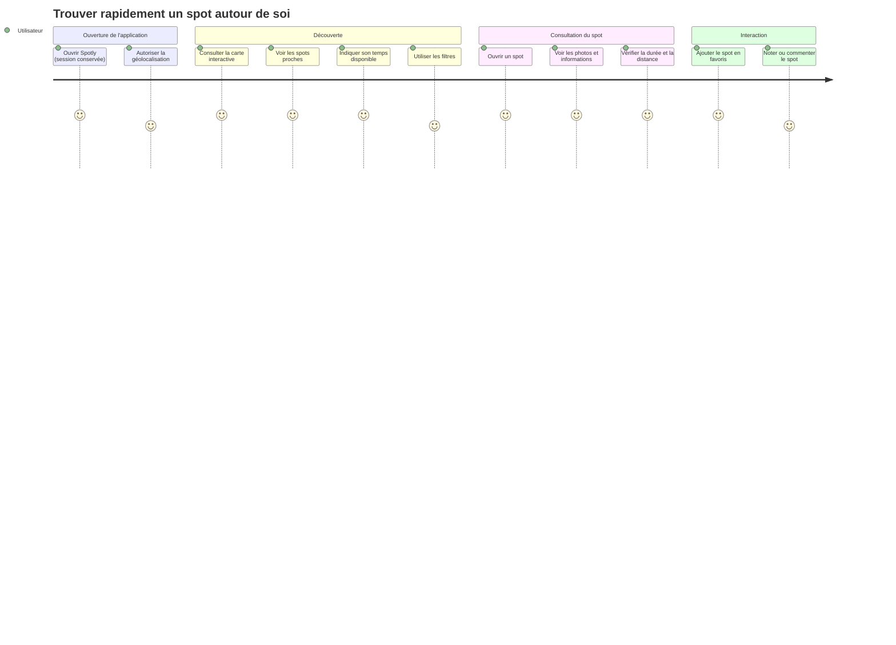
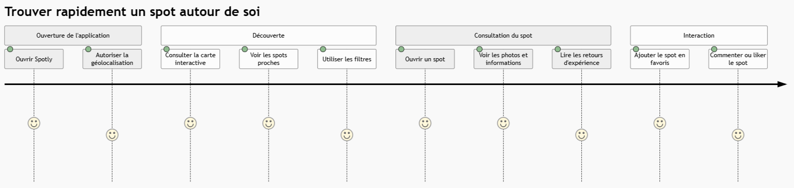
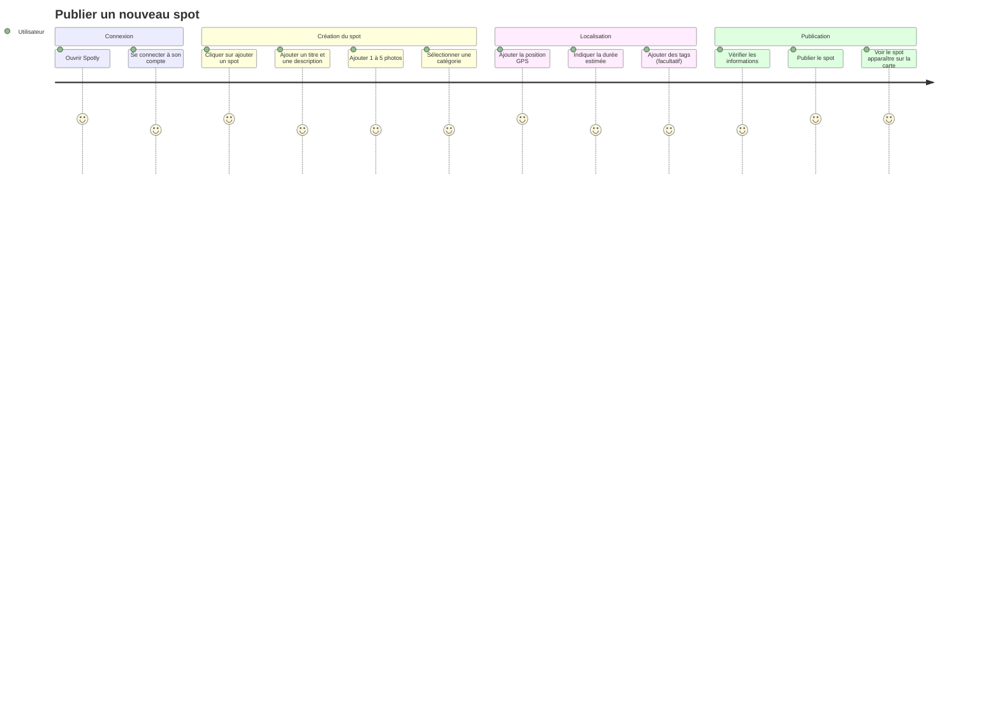
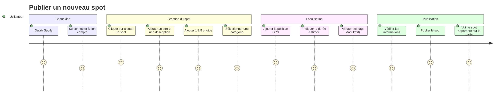

# User Journeys — Spotly

Ces parcours représentent le ressenti de l'utilisateur à chaque étape, sur une échelle de 1 (difficile) à 5 (agréable). Ils correspondent aux parcours détaillés dans [3.4 Parcours utilisateurs et scénarios](<3.4_Parcours_utilisateurs_&_scénarios.md>).

> Dans le premier parcours, la notation et les commentaires sont des évolutions (P2) : ils ne font pas partie du MVP.

## Découverte d’un spot

## Publication d’un spot

