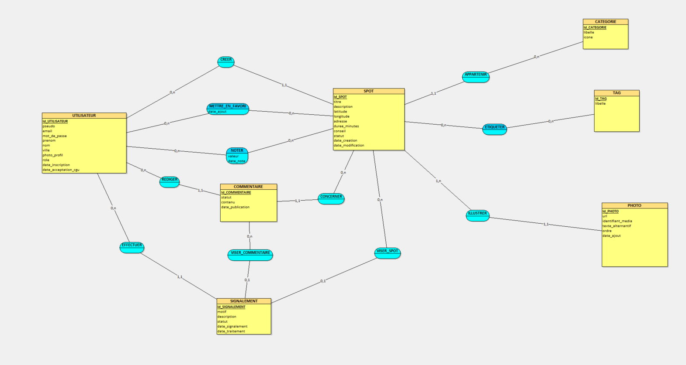

# Modèle Conceptuel de Données (MCD) — Spotly

## 1. Objectif

Le MCD décrit **les informations que Spotly doit enregistrer et les liens entre elles**. Il ne dépend d'aucune technologie : on n'y trouve ni table, ni clé étrangère, ni type PostgreSQL. Ces éléments apparaîtront dans le MLD, puis dans le MPD.

Le MCD a été construit en trois étapes :

1. lister les **règles de gestion** à partir du [cahier des charges fonctionnel](cahier-des-charges-fonctionnel.md) ;
2. en déduire les **entités** et leurs **attributs** ;
3. relier les entités par des **associations** et fixer leurs **cardinalités**, chacune justifiée par une règle de gestion.

Il est réalisé avec **Looping**, selon la méthode Merise.

---

## 2. Périmètre

Le MCD couvre le MVP et les évolutions prévues (commentaires, notes, signalements). Les prévoir dès maintenant évite de devoir modifier la structure de la base plus tard.

Les likes, les préférences utilisateur, les notifications et l'offre professionnelle ne sont pas modélisés, car ils ne font pas partie du périmètre actuel.

---

## 3. Règles de gestion

| N° | Règle de gestion |
| --- | --- |
| RG-01 | Une adresse e-mail ne peut être utilisée que par un seul compte. |
| RG-02 | Un pseudo ne peut être utilisé que par un seul compte. |
| RG-03 | Un utilisateur a un rôle : utilisateur ou administrateur. |
| RG-03b | Un utilisateur doit accepter les conditions d'utilisation pour créer son compte. |
| RG-04 | Un spot est créé par un seul utilisateur. Un utilisateur peut créer plusieurs spots. |
| RG-05 | Un spot appartient à une seule catégorie. Une catégorie peut regrouper plusieurs spots. |
| RG-06 | Un spot a entre 1 et 5 photos. Une photo appartient à un seul spot. |
| RG-07 | Un spot peut avoir plusieurs tags. Un tag peut être utilisé par plusieurs spots. |
| RG-08 | La durée d'un spot est exprimée en minutes et doit être supérieure à 0. |
| RG-09 | Les coordonnées GPS d'un spot doivent être valides (latitude entre -90 et 90, longitude entre -180 et 180). |
| RG-10 | Un spot a un statut : publié, masqué ou supprimé. |
| RG-11 | Un utilisateur peut mettre plusieurs spots en favoris, mais un même spot une seule fois. |
| RG-12 | Un utilisateur peut noter plusieurs spots, mais une seule fois chacun, avec une note de 1 à 5. |
| RG-13 | Un commentaire est écrit par un seul utilisateur et porte sur un seul spot. Il ne peut pas être vide. |
| RG-14 | Un commentaire a un statut : publié, masqué ou supprimé. |
| RG-15 | Un signalement est fait par un seul utilisateur. |
| RG-16 | Un signalement vise soit un spot, soit un commentaire, jamais les deux et jamais aucun. |
| RG-17 | Un signalement a un statut : en attente, traité ou classé sans suite. |

---

## 4. Les entités

Une **entité** représente un objet qui a sa propre existence et qu'on peut identifier de façon unique grâce à un **identifiant** (souligné dans le schéma).

Les types indiqués sont des types généraux. Ils seront précisés pour PostgreSQL dans le MPD.

### 4.1 UTILISATEUR

Une personne inscrite sur Spotly. Un administrateur est un utilisateur dont le rôle est `ADMINISTRATEUR`.

| Attribut | Type | Contraintes | Description |
| --- | --- | --- | --- |
| **id_utilisateur** | Identifiant | | Identifiant unique |
| pseudo | Texte (30) | Obligatoire, unique | Nom affiché comme auteur |
| email | Texte (255) | Obligatoire, unique | Adresse de connexion |
| mot_de_passe | Texte (255) | Obligatoire | Mot de passe **haché** (jamais en clair) |
| prenom | Texte (50) | Facultatif | Prénom, affiché sur le profil |
| nom | Texte (50) | Facultatif | Nom, affiché sur le profil |
| ville | Texte (100) | Facultatif | Ville indiquée par l'utilisateur sur son profil |
| photo_profil | Texte (500) | Facultatif | Adresse de la photo de profil sur Cloudinary |
| role | Liste de valeurs | Obligatoire | `UTILISATEUR` (par défaut) ou `ADMINISTRATEUR` |
| date_inscription | Date et heure | Obligatoire | Date de création du compte |
| date_acceptation_cgu | Date et heure | Obligatoire | Date à laquelle l'utilisateur a accepté les conditions d'utilisation |

### 4.2 SPOT

Une expérience locale proposée par la communauté. C'est l'entité centrale de l'application.

| Attribut | Type | Contraintes | Description |
| --- | --- | --- | --- |
| **id_spot** | Identifiant | | Identifiant unique |
| titre | Texte (100) | Obligatoire | Titre du spot |
| description | Texte long | Obligatoire | Description de l'expérience |
| latitude | Décimal | Obligatoire, entre -90 et 90 | Position GPS |
| longitude | Décimal | Obligatoire, entre -180 et 180 | Position GPS |
| adresse | Texte (255) | Facultatif | Adresse lisible du spot (ex. : Chemin des Sources, 38190) |
| duree_minutes | Entier | Obligatoire, supérieur à 0 | Durée estimée de l'expérience |
| conseil | Texte (300) | Facultatif | Conseil pratique (ex. : prévoir de bonnes chaussures) |
| statut | Liste de valeurs | Obligatoire | `PUBLIE` (par défaut), `MASQUE` ou `SUPPRIME` |
| date_creation | Date et heure | Obligatoire | Date de publication |
| date_modification | Date et heure | Obligatoire | Date de la dernière modification |

### 4.3 CATEGORIE

Le type principal d'un spot (Café, Point de vue, Plage et baignade…).

| Attribut | Type | Contraintes | Description |
| --- | --- | --- | --- |
| **id_categorie** | Identifiant | | Identifiant unique |
| libelle | Texte (50) | Obligatoire, unique | Nom de la catégorie |
| icone | Texte (50) | Obligatoire | Icône du marqueur sur la carte |

### 4.4 TAG

Une précision sur un spot (gratuit, wifi, coucher de soleil…).

| Attribut | Type | Contraintes | Description |
| --- | --- | --- | --- |
| **id_tag** | Identifiant | | Identifiant unique |
| libelle | Texte (50) | Obligatoire, unique | Nom du tag |

### 4.5 PHOTO

Une image qui illustre un spot.

| Attribut | Type | Contraintes | Description |
| --- | --- | --- | --- |
| **id_photo** | Identifiant | | Identifiant unique |
| url | Texte (500) | Obligatoire | Adresse de l'image sur Cloudinary |
| identifiant_media | Texte (255) | Obligatoire, unique | Identifiant de l'image sur Cloudinary |
| texte_alternatif | Texte (150) | Facultatif | Description de l'image pour l'accessibilité |
| ordre | Entier | Obligatoire, de 1 à 5 | Position de la photo dans la galerie |
| date_ajout | Date et heure | Obligatoire | Date d'ajout |

### 4.6 COMMENTAIRE

Un retour d'expérience publié sur un spot.

| Attribut | Type | Contraintes | Description |
| --- | --- | --- | --- |
| **id_commentaire** | Identifiant | | Identifiant unique |
| contenu | Texte (1000) | Obligatoire, non vide | Texte du commentaire |
| statut | Liste de valeurs | Obligatoire | `PUBLIE` (par défaut), `MASQUE` ou `SUPPRIME` |
| date_publication | Date et heure | Obligatoire | Date de publication |

### 4.7 SIGNALEMENT

Le signalement d'un contenu problématique par un utilisateur.

| Attribut | Type | Contraintes | Description |
| --- | --- | --- | --- |
| **id_signalement** | Identifiant | | Identifiant unique |
| motif | Liste de valeurs | Obligatoire | `CONTENU_INAPPROPRIE`, `INFORMATION_INCORRECTE`, `SPAM`, `SPOT_INEXISTANT` ou `AUTRE` |
| description | Texte (500) | Facultatif | Précisions de l'utilisateur |
| statut | Liste de valeurs | Obligatoire | `EN_ATTENTE` (par défaut), `TRAITE` ou `CLASSE_SANS_SUITE` |
| date_signalement | Date et heure | Obligatoire | Date du signalement |
| date_traitement | Date et heure | Facultatif | Date du traitement par un administrateur |

---

## 5. Les associations et leurs cardinalités

Une **association** relie des entités. Ses **cardinalités** indiquent combien de fois, au minimum et au maximum, chaque entité participe à l'association.

**Comment lire une cardinalité :** on part de l'entité. Par exemple, pour `UTILISATEUR (0,n) — CREER — (1,1) SPOT` :

- « un utilisateur crée **0 ou plusieurs** spots » ;
- « un spot est créé par **1 et 1 seul** utilisateur ».

| Association | Entité | Card. | Card. | Entité | Règle |
| --- | --- | --- | --- | --- | --- |
| CREER | UTILISATEUR | 0,n | 1,1 | SPOT | RG-04 |
| APPARTENIR | SPOT | 1,1 | 0,n | CATEGORIE | RG-05 |
| ILLUSTRER | SPOT | 1,n | 1,1 | PHOTO | RG-06 |
| ETIQUETER | SPOT | 0,n | 0,n | TAG | RG-07 |
| METTRE_EN_FAVORI | UTILISATEUR | 0,n | 0,n | SPOT | RG-11 |
| NOTER | UTILISATEUR | 0,n | 0,n | SPOT | RG-12 |
| REDIGER | UTILISATEUR | 0,n | 1,1 | COMMENTAIRE | RG-13 |
| CONCERNER | SPOT | 0,n | 1,1 | COMMENTAIRE | RG-13 |
| EFFECTUER | UTILISATEUR | 0,n | 1,1 | SIGNALEMENT | RG-15 |
| VISER_SPOT | SPOT | 0,n | 0,1 | SIGNALEMENT | RG-16 |
| VISER_COMMENTAIRE | COMMENTAIRE | 0,n | 0,1 | SIGNALEMENT | RG-16 |

### Justification des cardinalités

**CREER** — Un utilisateur peut n'avoir créé aucun spot, ou plusieurs (0,n). Un spot a toujours un seul créateur (1,1).

**APPARTENIR** — Un spot a une seule catégorie, obligatoire (1,1), qui détermine son marqueur sur la carte. Une catégorie peut ne contenir encore aucun spot (0,n).

**ILLUSTRER** — Un spot a au moins une photo (1,n), car les photos aident l'utilisateur à décider. Une photo appartient à un seul spot (1,1). Le maximum de 5 photos ne peut pas s'écrire avec une cardinalité : il sera vérifié par l'API.

**ETIQUETER** — Les tags sont facultatifs : un spot peut n'en avoir aucun ou plusieurs, et un tag peut n'être utilisé par aucun spot ou par plusieurs (0,n des deux côtés).

**METTRE_EN_FAVORI** — Un utilisateur peut avoir 0 ou plusieurs favoris, et un spot peut être en favori chez 0 ou plusieurs utilisateurs. L'association porte la **date d'ajout**, qui permet de trier les favoris du plus récent au plus ancien.

**NOTER** — Même raisonnement que pour les favoris. L'association porte la **valeur** de la note et sa **date**.

**REDIGER** et **CONCERNER** — Un commentaire a toujours un seul auteur et porte toujours sur un seul spot (1,1). Un utilisateur peut ne jamais commenter, et un spot peut n'avoir aucun commentaire (0,n).

**EFFECTUER** — Un signalement est toujours fait par un utilisateur identifié (1,1). Il n'y a pas de signalement anonyme, ce qui limite les abus.

**VISER_SPOT** et **VISER_COMMENTAIRE** — Un signalement peut viser un spot (0,1) ou un commentaire (0,1). Un même spot ou commentaire peut être signalé plusieurs fois (0,n). La règle « exactement un des deux » (RG-16) ne peut pas s'écrire avec des cardinalités : elle sera vérifiée par l'API et par une contrainte dans la base de données.

---

## 6. Explication des choix

### Le favori et la note sont des associations, pas des entités

Un favori n'existe pas tout seul : c'est seulement un lien entre un utilisateur et un spot, avec une date. C'est donc une **association qui porte une donnée**, et non une entité. C'est la même chose pour la note.

Dans le MLD, ces associations deviendront des tables dont la clé primaire sera le couple (utilisateur, spot). Ce couple ne pouvant exister qu'une fois, la base de données empêchera automatiquement de mettre deux fois le même spot en favori ou de le noter deux fois.

### La note est séparée du commentaire

Si la note était dans le commentaire, un utilisateur pourrait noter plusieurs fois le même spot en écrivant plusieurs commentaires. En la séparant, on garantit une seule note par utilisateur et par spot, et on peut noter sans commenter.

### L'administrateur est un rôle, pas une entité

Un administrateur a exactement les mêmes informations qu'un utilisateur. Seuls ses droits changent. Un attribut `role` suffit donc. Les droits sont vérifiés par l'API à chaque action d'administration.

### La catégorie est une entité, pas un simple texte

Si la catégorie était un texte saisi dans le spot, on risquerait des fautes (« Plage », « plage », « Plages »). En faisant une entité, chaque catégorie n'existe qu'une fois : on peut la renommer à un seul endroit et lui associer une icône.

### Les photos ne sont pas stockées dans la base

La base ne contient que l'adresse de l'image et son identifiant chez Cloudinary, le service qui héberge et optimise les images. L'identifiant permet de supprimer l'image chez Cloudinary quand elle n'est plus utilisée, pour ne pas garder de fichiers inutiles (éco-conception).

### La durée est stockée en minutes

Stocker un nombre de minutes plutôt qu'un texte comme « 1 h » permet de comparer directement la durée d'un spot au temps disponible de l'utilisateur. Les durées proposées dans l'interface (30 min, 1 h, 2 h, demi-journée, journée) correspondent à 30, 60, 120, 240 et 480 minutes.

### Les données calculées ne sont pas stockées

- La **note moyenne** se calcule à partir des notes. La stocker en plus risquerait de créer des incohérences.
- La **distance** entre l'utilisateur et un spot dépend de la position de l'utilisateur au moment de la recherche. Ce n'est pas une information du spot.

### Les spots et les commentaires ne sont pas effacés

Quand un spot ou un commentaire est supprimé, son statut passe à `SUPPRIME` au lieu d'effacer la ligne. On parle de **suppression logique**. Les signalements qui le concernent restent ainsi cohérents, et l'administrateur garde une trace.

### Seules les données utiles sont obligatoires

Pour créer un compte, l'utilisateur ne fournit qu'un pseudo, une adresse e-mail et un mot de passe. Le prénom, le nom, la ville et la photo de profil sont **facultatifs** : il les ajoute s'il le souhaite depuis son profil. Sa position GPS n'est jamais enregistrée. C'est une application du principe de **minimisation des données** du RGPD.

La date d'acceptation des conditions d'utilisation est enregistrée pour pouvoir prouver que l'utilisateur les a acceptées.

### L'adresse complète les coordonnées GPS

Les coordonnées GPS servent aux calculs (zone de la carte, distance). L'adresse, facultative, sert uniquement à l'affichage : elle est plus lisible pour l'utilisateur que des coordonnées.

---

## 7. Règles vérifiées en dehors du MCD

Certaines règles ne peuvent pas être représentées dans un MCD. Elles seront garanties par la base de données ou par l'API.

| Règle | Comment elle sera garantie |
| --- | --- |
| 5 photos maximum par spot (RG-06) | Vérification par l'API |
| Note comprise entre 1 et 5 (RG-12) | Contrainte dans la base et vérification par l'API |
| Durée supérieure à 0 (RG-08) | Contrainte dans la base et vérification par l'API |
| Coordonnées GPS valides (RG-09) | Contraintes dans la base et vérification par l'API |
| Un signalement vise un spot ou un commentaire, pas les deux (RG-16) | Contrainte dans la base et vérification par l'API |
| Seul un administrateur peut masquer un spot ou traiter un signalement | Vérification du rôle par l'API |
| Seul l'auteur d'un spot ou d'un commentaire peut le modifier ou le supprimer | Vérification par l'API |
| Un spot masqué ne peut pas être republié par son créateur | Vérification par l'API |

---

## 8. Vers le MLD

Le passage au MLD suit les règles classiques de Merise :

| Dans le MCD | Dans le MLD |
| --- | --- |
| Une entité | Une table, avec l'identifiant comme clé primaire |
| Une association avec (1,1) ou (0,1) d'un côté | Une clé étrangère dans la table de ce côté |
| Une association avec (0,n) ou (1,n) des deux côtés | Une nouvelle table, dont la clé primaire est formée des deux clés étrangères |

On obtiendra **10 tables** : les 7 entités, plus ETIQUETER, METTRE_EN_FAVORI et NOTER.
