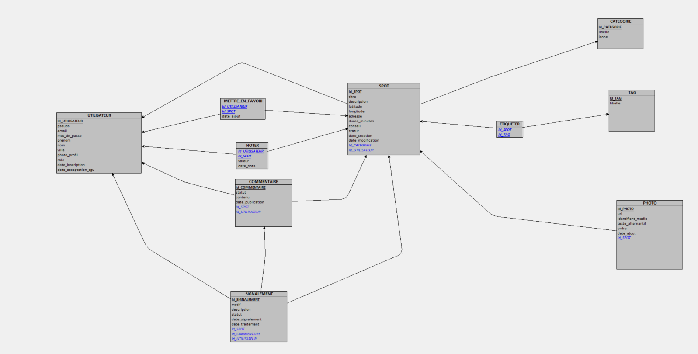

# Modèle Logique de Données (MLD) — Spotly

## 1. Objectif

Le MLD traduit le [MCD](mcd.md) en **tables relationnelles**. Il fait apparaître trois éléments absents du MCD :

- les **clés primaires** : la colonne, ou le groupe de colonnes, qui identifie chaque ligne d'une table ;
- les **clés étrangères** : une colonne qui fait référence à la clé primaire d'une autre table et matérialise ainsi un lien ;
- les **tables d'association**, issues des associations « plusieurs-à-plusieurs ».

Le MLD ne dépend pas du logiciel de base de données. Les types précis (PostgreSQL) seront fixés dans le MPD.

Ce MLD a été **généré par Looping** à partir du MCD validé, puis vérifié règle par règle (voir section 2).



**Comment lire le schéma Looping :**

- une colonne **soulignée en gras** est une clé primaire ;
- une colonne *en italique bleu* est une clé étrangère ;
- une flèche part de la table qui contient la clé étrangère et pointe vers la table référencée.

Dans le texte ci-dessous, la clé primaire est en **gras** et une clé étrangère est précédée de `#`.

---

## 2. Règles de passage du MCD au MLD

| Dans le MCD | Règle appliquée | Résultat dans le MLD |
| --- | --- | --- |
| Une entité | Elle devient une table et son identifiant devient la clé primaire. | 7 tables : UTILISATEUR, SPOT, CATEGORIE, TAG, PHOTO, COMMENTAIRE, SIGNALEMENT |
| Une association avec une cardinalité **(1,1)** d'un côté | On ajoute une clé étrangère **obligatoire** dans la table de ce côté. | Par exemple, CREER ajoute `#Id_UTILISATEUR` dans SPOT. |
| Une association avec une cardinalité **(0,1)** d'un côté | On ajoute une clé étrangère **facultative** (elle peut être vide) dans la table de ce côté. | VISER_SPOT et VISER_COMMENTAIRE ajoutent `#Id_SPOT` et `#Id_COMMENTAIRE` dans SIGNALEMENT. |
| Une association **(0,n) / (0,n)** | Elle devient une table. Sa clé primaire est composée des deux clés étrangères et ses attributs deviennent des colonnes. | 3 tables : METTRE_EN_FAVORI, NOTER, ETIQUETER |

Le MLD compte au total **10 tables**.

---

## 3. Schéma relationnel

```
UTILISATEUR (Id_UTILISATEUR, pseudo, email, mot_de_passe, prenom, nom, ville, photo_profil,
             role, date_inscription, date_acceptation_cgu)

CATEGORIE (Id_CATEGORIE, libelle, icone)

TAG (Id_TAG, libelle)

SPOT (Id_SPOT, titre, description, latitude, longitude, adresse, duree_minutes, conseil,
      statut, date_creation, date_modification, #Id_CATEGORIE, #Id_UTILISATEUR)

PHOTO (Id_PHOTO, url, identifiant_media, texte_alternatif, ordre, date_ajout, #Id_SPOT)

COMMENTAIRE (Id_COMMENTAIRE, statut, contenu, date_publication, #Id_SPOT, #Id_UTILISATEUR)

SIGNALEMENT (Id_SIGNALEMENT, motif, description, statut, date_signalement, date_traitement,
             #Id_SPOT, #Id_COMMENTAIRE, #Id_UTILISATEUR)

METTRE_EN_FAVORI (#Id_UTILISATEUR, #Id_SPOT, date_ajout)

NOTER (#Id_UTILISATEUR, #Id_SPOT, valeur, date_note)

ETIQUETER (#Id_SPOT, #Id_TAG)
```

| Table | Clé primaire |
| --- | --- |
| UTILISATEUR | **Id_UTILISATEUR** |
| CATEGORIE | **Id_CATEGORIE** |
| TAG | **Id_TAG** |
| SPOT | **Id_SPOT** |
| PHOTO | **Id_PHOTO** |
| COMMENTAIRE | **Id_COMMENTAIRE** |
| SIGNALEMENT | **Id_SIGNALEMENT** |
| METTRE_EN_FAVORI | **(Id_UTILISATEUR, Id_SPOT)**, clé composée |
| NOTER | **(Id_UTILISATEUR, Id_SPOT)**, clé composée |
| ETIQUETER | **(Id_SPOT, Id_TAG)**, clé composée |

---

## 4. Les clés étrangères

| Table | Clé étrangère | Fait référence à | Obligatoire ? | Association d'origine |
| --- | --- | --- | --- | --- |
| SPOT | Id_UTILISATEUR | UTILISATEUR | Oui | CREER (1,1) : le créateur du spot |
| SPOT | Id_CATEGORIE | CATEGORIE | Oui | APPARTENIR (1,1) |
| PHOTO | Id_SPOT | SPOT | Oui | ILLUSTRER (1,1) |
| COMMENTAIRE | Id_UTILISATEUR | UTILISATEUR | Oui | REDIGER (1,1) : l'auteur du commentaire |
| COMMENTAIRE | Id_SPOT | SPOT | Oui | CONCERNER (1,1) |
| SIGNALEMENT | Id_UTILISATEUR | UTILISATEUR | Oui | EFFECTUER (1,1) : l'auteur du signalement |
| SIGNALEMENT | Id_SPOT | SPOT | **Non** | VISER_SPOT (0,1) |
| SIGNALEMENT | Id_COMMENTAIRE | COMMENTAIRE | **Non** | VISER_COMMENTAIRE (0,1) |
| METTRE_EN_FAVORI | Id_UTILISATEUR, Id_SPOT | UTILISATEUR, SPOT | Oui | METTRE_EN_FAVORI |
| NOTER | Id_UTILISATEUR, Id_SPOT | UTILISATEUR, SPOT | Oui | NOTER |
| ETIQUETER | Id_SPOT, Id_TAG | SPOT, TAG | Oui | ETIQUETER |

**Cas de SIGNALEMENT.** Un signalement vise **soit** un spot, **soit** un commentaire. Ses deux clés étrangères sont donc facultatives : l'une est remplie et l'autre reste vide. Le MLD ne peut pas exprimer la règle « exactement une des deux ». C'est le MPD qui l'impose, grâce à une contrainte `CHECK` (décision D10).

---

## 5. Contraintes d'unicité

Au-delà des clés primaires, certaines colonnes ne doivent jamais contenir deux fois la même valeur.

| Table | Colonne(s) uniques | Raison |
| --- | --- | --- |
| UTILISATEUR | email | Une adresse e-mail ne sert qu'à un seul compte. |
| UTILISATEUR | pseudo | Un pseudo ne sert qu'à un seul compte (D11). |
| CATEGORIE | libelle | Une catégorie n'existe qu'une fois. |
| TAG | libelle | Un tag n'existe qu'une fois. |
| PHOTO | identifiant_media | Une image Cloudinary n'est rattachée qu'à une seule photo. |
| PHOTO | (Id_SPOT, ordre) | Deux photos d'un même spot ne peuvent pas occuper la même position. |

Les clés primaires composées garantissent déjà deux règles : un utilisateur ne met un spot en favori qu'**une fois** (METTRE_EN_FAVORI) et ne le note qu'**une fois** (NOTER). Il n'y a donc rien à ajouter pour elles.

---

## 6. Choix de nommage

Le MLD conserve **les noms produits par Looping** (`Id_UTILISATEUR`, `METTRE_EN_FAVORI`…). Ce choix garde un lien direct et vérifiable entre le MCD et le MLD : chaque table et chaque clé se retrouve sous le même nom dans les deux modèles.

Au moment du **MPD**, puis du schéma Prisma, les noms seront rendus plus lisibles pour le code :

| MLD (Looping) | MPD / base de données | Pourquoi |
| --- | --- | --- |
| SPOT.Id_UTILISATEUR | spot.id_createur | Indique le rôle de l'utilisateur dans ce lien. |
| COMMENTAIRE.Id_UTILISATEUR | commentaire.id_auteur | Même raison. |
| SIGNALEMENT.Id_UTILISATEUR | signalement.id_auteur | Même raison. |
| METTRE_EN_FAVORI | favori | Nom de table plus court et naturel |
| NOTER | note | Idem |
| ETIQUETER | spot_tag | Montre les deux tables reliées. |
| Id_XXX | id_xxx | Tout en minuscules, la convention de PostgreSQL |

Le renommage ne modifie **ni les tables, ni les clés, ni les liens**. Seul le vocabulaire change.

---

## 7. Vers le MPD

Le MPD précisera, pour PostgreSQL :

- le **type** de chaque colonne (texte, nombre, date…) ;
- les **contraintes de vérification** (`CHECK`) : note entre 1 et 5, durée positive, coordonnées valides, un signalement visant exactement un contenu ;
- les **valeurs par défaut** : statut `PUBLIE`, rôle `UTILISATEUR`, date du jour ;
- les **règles de suppression** : ce qui arrive aux données liées quand une ligne est supprimée ;
- les **index** qui accélèrent les recherches fréquentes, par exemple les spots d'une zone de la carte.
